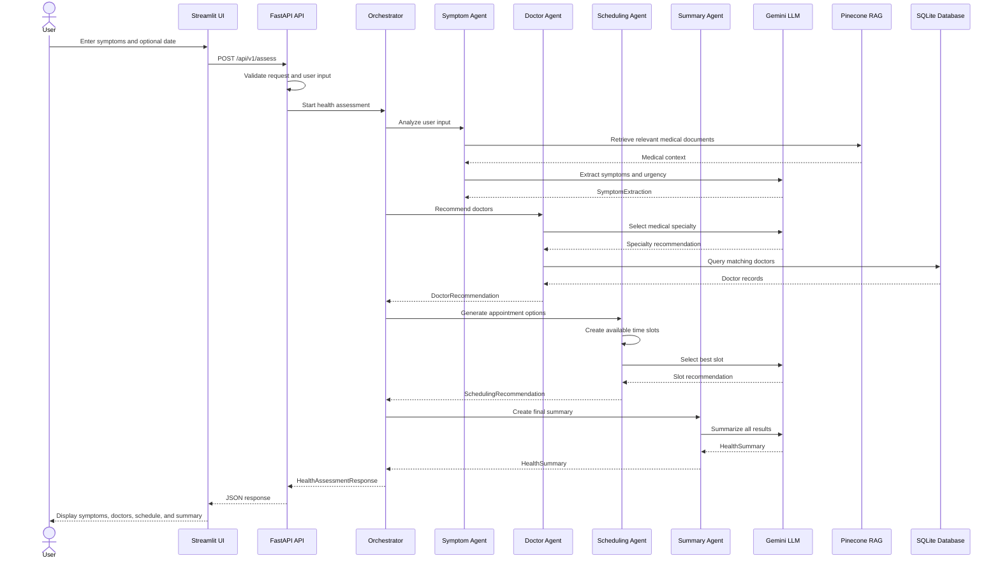

# HealthLink High-Level Design

## 1. Purpose

HealthLink accepts a user's health concern, analyzes the symptoms with Google Gemini and medical knowledge from Pinecone, recommends doctors from SQLite, generates appointment options, and returns a health summary.

This document describes the main execution flow and the files involved. It is intentionally high level.

## 2. Main Request Flow



## 3. Startup Flow

1. `main.py` creates the FastAPI application.
2. `config/settings.py` loads environment variables and validates API keys.
3. `config/logging.py` configures application logging.
4. `core/database.py` creates the SQLite tables.
5. `data/doctors.csv` is loaded and used to seed the doctors table.
6. `data/symptoms_kb.json` is loaded by `core/rag.py`.
7. RAG chunks the knowledge base, creates embeddings, and stores them in Pinecone.
8. The API becomes available at `http://localhost:8000`.

## 4. Assessment Flow by File

### Step 1: User interface

File: `ui/streamlit_app.py`

- Collects symptom description, user ID, and preferred date.
- Calls `POST /api/v1/assess`.
- Displays the four returned result sections.

The UI is optional. The API can also be called directly.

### Step 2: API entrypoint

File: `api/routes.py`

Endpoint: `POST /api/v1/assess`

- Receives a `HealthAssessmentRequest`.
- Validates the request through `core/orchestrator.py`.
- Validates the text through `utils/validators.py`.
- Creates or obtains the database session and LLM client.
- Calls `orchestrate_health_assessment()`.
- Returns a `HealthAssessmentResponse`.

### Step 3: Workflow coordination

File: `core/orchestrator.py`

`orchestrate_health_assessment()` calls the agents in this order:

1. `agents/symptom_agent.py`
2. `agents/doctor_agent.py`
3. `agents/scheduling_agent.py`
4. `agents/summary_agent.py`

It generates the request ID and combines all agent results into the final response.

### Step 4: Symptom analysis

File: `agents/symptom_agent.py`

- Calls `core/rag.py` to retrieve relevant medical context.
- Calls `core/llm.py` to analyze the complaint.
- Returns `SymptomExtraction` from `core/schemas.py`.

The result includes symptoms, severity, duration, primary complaint, and urgency.

### Step 5: Doctor recommendation

File: `agents/doctor_agent.py`

- Uses the symptom analysis to ask Gemini for a medical specialty.
- Queries doctors through `core/database.py`.
- Sorts matching doctors by rating.
- Returns up to three doctors as `DoctorRecommendation`.

### Step 6: Scheduling

File: `agents/scheduling_agent.py`

- Generates weekday time slots for recommended doctors.
- Uses urgency and the preferred date to determine scheduling context.
- Asks Gemini to select a recommended slot.
- Returns `SchedulingRecommendation`.

The current implementation generates mock slots. It does not book or persist an appointment.

### Step 7: Summary generation

File: `agents/summary_agent.py`

- Combines symptom, doctor, and scheduling results.
- Calls `core/llm.py` to create a patient-friendly summary.
- Returns `HealthSummary` with findings, actions, urgency, and disclaimer.

## 5. Shared Components

| File | Responsibility |
| --- | --- |
| `main.py` | FastAPI application and startup/shutdown lifecycle |
| `config/settings.py` | Environment-based configuration |
| `config/logging.py` | Logging setup |
| `api/routes.py` | HTTP endpoints |
| `core/orchestrator.py` | Coordinates the agent pipeline |
| `core/schemas.py` | Pydantic request and response contracts |
| `core/llm.py` | Gemini and structured LLM output handling |
| `core/rag.py` | Embeddings, Pinecone indexing, and retrieval |
| `core/database.py` | SQLite models, sessions, and doctor queries |
| `utils/validators.py` | Input validation helpers |
| `agents/` | Health assessment business steps |
| `ui/streamlit_app.py` | Optional web interface |
| `data/` | Doctors and symptom knowledge-base data |

## 6. Response Contract

The API returns a `HealthAssessmentResponse` defined in `core/schemas.py`:

```text
HealthAssessmentResponse
├── request_id
├── timestamp
├── symptom_analysis: SymptomExtraction
├── doctor_recommendations: DoctorRecommendation
├── scheduling_options: SchedulingRecommendation
├── health_summary: HealthSummary
└── metadata
```

## 7. Failure Handling

Each agent has a fallback path:

- If RAG retrieval fails, symptom analysis continues without RAG context.
- If symptom LLM generation fails, a medium-urgency fallback is returned.
- If doctor selection fails, General Practice doctors are used when available.
- If slot selection fails, the first generated slot is recommended.
- If summary generation fails, a basic summary and medical disclaimer are returned.
- API-level failures are returned as HTTP errors.

## 8. Important Current Boundaries

- Gemini is used for structured symptom, specialty, slot, and summary generation.
- Pinecone is used only for retrieval context during symptom analysis.
- SQLite stores doctor and appointment-related models, but the current scheduling flow does not persist bookings.
- The async functions are wrappers around synchronous implementations.
- The system provides guidance only and is not a medical diagnosis system.
